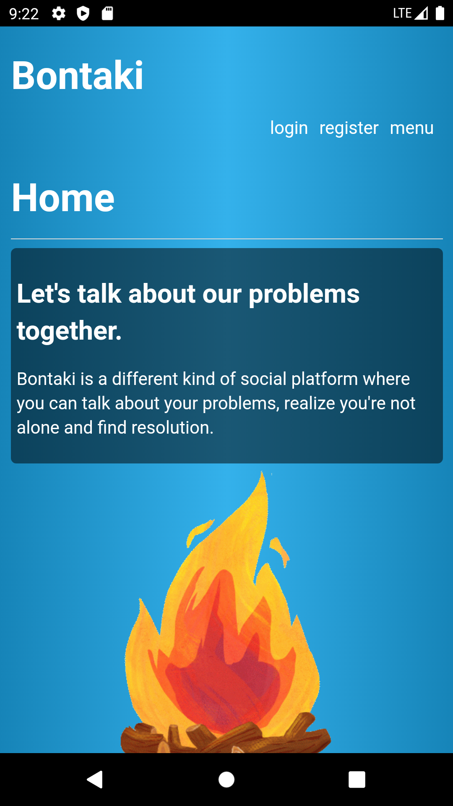
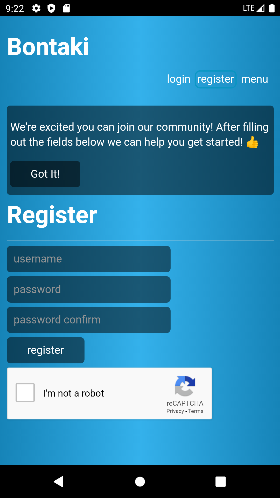
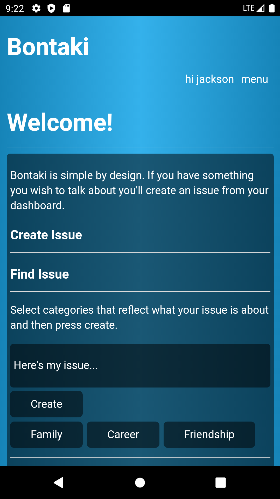
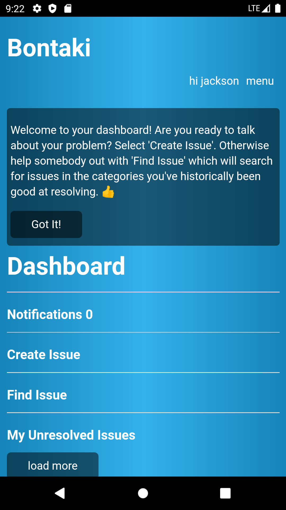
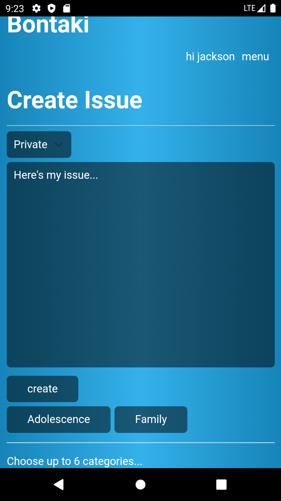
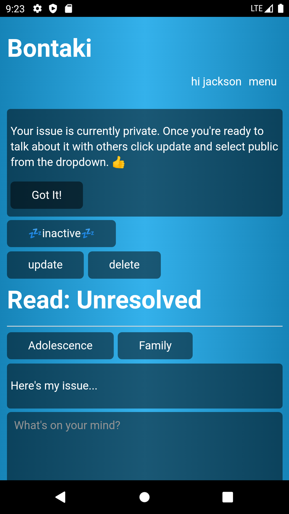
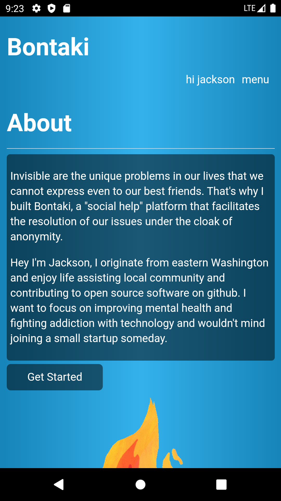

<p align="center">
  
</p>

<p align="center">
 
 
</p>

[](https://play.google.com/store/apps/details?id=com.jacksonelfersdev.bontaki)

<p align="center">Let's talk about our problems together.</p>

[](https://github.com/jackson-elfers/bontaki/blob/master/public/images/shot_01.png)
[](https://github.com/jackson-elfers/bontaki/blob/master/public/images/shot_02.png)
[](https://github.com/jackson-elfers/bontaki/blob/master/public/images/shot_03.png)
[](https://github.com/jackson-elfers/bontaki/blob/master/public/images/shot_04.png)
[](https://github.com/jackson-elfers/bontaki/blob/master/public/images/shot_05.png)
[](https://github.com/jackson-elfers/bontaki/blob/master/public/images/shot_06.png)
[](https://github.com/jackson-elfers/bontaki/blob/master/public/images/shot_07.png)

## Development Installation - linux

1. install/configure mysql

```
sudo apt-get update
sudo apt-get install mysql-server
sudo mysql_secure_installation utility
sudo systemctl start mysql
sudo mysql -u root -p
create database dev;
ALTER DATABASE dev CHARACTER SET = utf8mb4 COLLATE = utf8mb4_unicode_ci;
exit
```

2. clone the repo

```
git clone https://github.com/jackson-elfers/bontaki.git
cd bontaki
npm install && cd client && npm install && cd ..
```

3. create dev.env file on path: bontaki/env/dev.env

```
PORT=5000
MYSQL_CONNECTION_LIMIT=100
MYSQL_HOST=localhost
MYSQL_USER=admin
MYSQL_PASSWORD=12345
MYSQL_DATABASE=dev
MYSQL_SSL=false

JWT_SECRET=c6cab76a-9b12-4166-ae52-911ef05adfba
JWT_EXPIRATION=172800

RECAPTCHA_SECRET_KEY=
```

4. set development env for project with npm run script

```
npm run dev.env
```

5. obtain recaptcha credentials from [www.google.com](https://www.google.com/recaptcha/intro/v3.html)

6. start the development server

```
npm run dev
```
